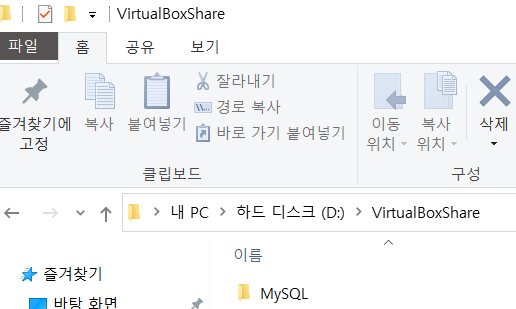
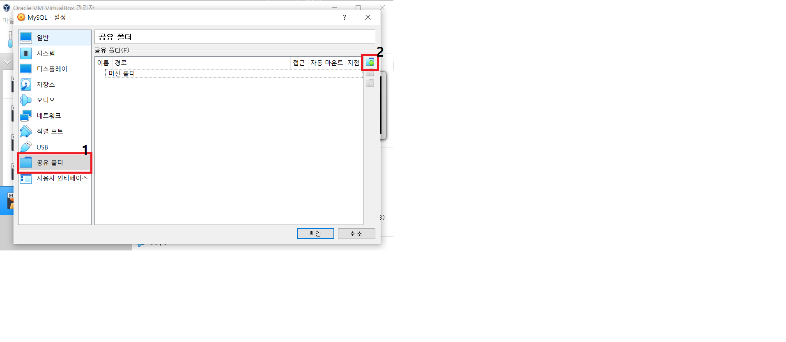
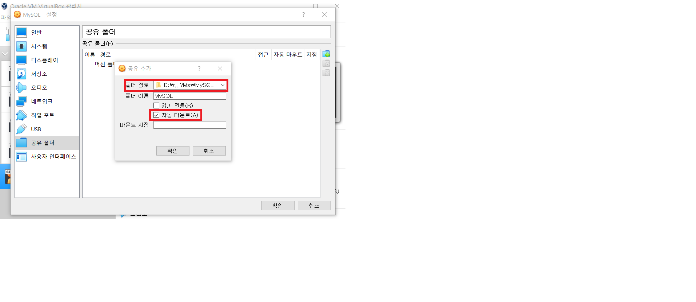
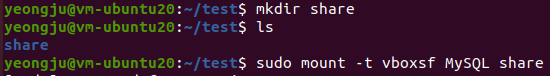

### Local PC에 공유 폴더 생성
 1. 원하는 위치에 공유 폴더 생성

 

### 공유 폴더 설정
  1. 나의 가상머신 설정 클릭
  2. 밑에 이미지 1번 2번 차례대로 클릭

  

  3. 폴더 경로 클릭 -> 기타 클릭 -> Local PC에 생성한 공유 폴더 클릭
  4. 자동 마운트 체크
  5. 확인 클릭

  

### 가상머신 마운트
  1. 공유 폴더 설정한 가상머신 실행
  2. Local PC와 폴더를 공유할 Directory 생성
  3. mount 실행

  ```ubuntu
  $ mkdir Local PC와 폴더를 공유할 Directory명
  $ sudo mount -t vboxsf (위에 Local PC 공유폴더 설정 시 폴더이름) (위에 생성한 Directory 경로)
  ```

  
